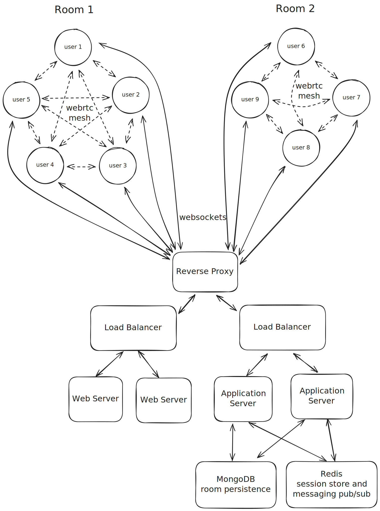

# p2piano

[](https://github.com/d-buckner/p2piano/actions)
[](https://www.gnu.org/licenses/agpl-3.0)

**The Best Way to Play Piano Together Online**

Perfect for music lessons, jamming with friends, or connecting with nearby musicians. Create a room and share the 5-letter code to start playing together instantly. No downloads, accounts, or setup required.

**[Try it out](https://p2piano.com)**


## Features

- **⚡ Real-Time Synchronization** - Minimal delay when playing together. Excellent performance locally, reliable quality across distances
- **🎵 High-Quality Piano Sounds** - Rich, expressive samples with multiple velocity layers for natural, dynamic playing
- **👥 Perfect for Music Education** - Ideal for remote lessons, ensemble practice, and collaborative learning
- **💝 Completely Free** - No subscriptions, ads, or premium tiers. Built for the music community and supported by donations
- **🌐 Universal Compatibility** - Works instantly in any browser on desktop, tablet, and mobile. MIDI keyboards connect seamlessly
- **🎙️ Active Development** - Regular updates bring new instruments and features. Built with modern technology, constantly improving

## How It Works

1. **Create a Room** - Click "Start Now" and get a simple 5-letter room code
2. **Share the Code** - Send the code to whoever you want to play with
3. **Start Playing** - Everyone can play piano together using keyboard, mouse, or touch

## Performance & Compatibility

- **🚀 Optimized for low latency** - Excellent performance nearby, good quality across distances
- **🎯 Best within 500 miles** - Works at any distance with increased delay
- **🔒 Private by design** - Only people with your room code can join. No recording or data collection
- **⚡ Instant access** - No downloads, accounts, or setup required
- **🆓 Always free** - No premium features, subscriptions, or ads

### Performance Tips
- **Avoid wireless headphones** - These add latency that affects timing
- **Use wired connections** when possible for best performance
- **Unmute iOS devices** to enable sound
- **Computer keyboard mapping** - A-K for white keys, W-O for black keys

## FAQ

**Do I need to download anything?**  
No downloads needed, runs instantly in your browser

**Is it really free?**  
Completely free, no subscriptions, ads, or hidden costs

**Do I need a MIDI keyboard?**  
Not required, works great with mouse, touch, or computer keyboard

**How well does it work across distances?**  
Best within 500 miles, works at any distance with increased delay

**Are my sessions private?**  
Completely private, only people with your room code can join

**Does it work on mobile?**  
Works everywhere, phones, tablets, desktops, any modern browser

## Development Setup

**Prerequisites:** Node.js 20+, Docker or Podman

```bash
git clone https://github.com/d-buckner/p2piano.git
cd p2piano
npm run bootstrap  # Install dependencies
npm run dev        # Start development environment
```

The application will be available at `http://localhost:5173`

## Project Structure

```
p2piano/
├── client/              # Frontend (SolidJS + TypeScript)
│   ├── src/
│   │   ├── actions/     # State management actions
│   │   ├── app/         # Store configuration
│   │   ├── audio/       # Audio engine & instruments
│   │   ├── clients/     # API communication
│   │   ├── components/  # UI components
│   │   ├── controllers/ # Input handling (keyboard, MIDI)
│   │   ├── networking/  # WebRTC & WebSocket
│   │   ├── pages/       # Route components
│   │   └── styles/      # Styling & themes
├── service/            # Backend (NestJS + TypeScript)
│   ├── src/
│   │   ├── clients/    # Database layer
│   │   ├── entities/   # Data models
│   │   ├── websockets/ # Real-time communication
│   │   ├── auth/       # Authentication & authorization
│   │   └── utils/      # Shared utilities
├── docker-compose.yml  # Container orchestration
├── package.json        # Workspace configuration
└── docs/               # Documentation & assets
```

### Technology Stack

- **Frontend**: SolidJS, TypeScript, Web Audio API, WebRTC
- **Backend**: NestJS, MongoDB, Redis, Socket.IO
- **Audio**: Custom synthesizers and high-quality piano samples
- **Networking**: Peer-to-peer with WebSocket fallback
- **Testing**: Comprehensive test coverage with automated CI/CD

## Development Commands

```bash
# Install dependencies for all packages
npm run bootstrap

# Start development servers (client + service)
npm run dev

# Run individual services
npm run client:dev    # Frontend only
npm run service:dev   # Backend only

# Testing
npm run test          # Run all tests
npm run test:coverage # Generate coverage reports
npm run test:watch    # Watch mode for development

# Code quality
npm run lint          # Check code style
npm run lint:fix      # Auto-fix issues
npm run typecheck     # TypeScript validation

# Production builds
npm run build         # Build all packages
npm run container     # Build and run with Docker
```

### Environment Variables

Copy `.env.example` to `.env` and configure the required settings:

```bash
# Required: Database connection
MONGO_URI=mongodb://localhost:27017/p2piano
MONGO_USERNAME=your_username
MONGO_PASSWORD=your_password

# Required: Redis connection for sessions and real-time coordination
REDIS_URI=redis://localhost:6379

# Required: Security
COOKIE_SECRET=your_secure_random_string

# Optional: Additional settings
NODE_ENV=development          # Defaults to 'development'
PORT=3001                     # Defaults to 3001
```

## Architecture



p2piano uses a hybrid peer-to-peer architecture optimized for low-latency musical collaboration:

- **Real-time sync engine** measures network latency and schedules audio events for precise timing
- **Peer-to-peer networking** via WebRTC keeps musical data direct between participants
- **WebSocket fallback** through Redis pub/sub ensures connectivity when P2P isn't available
- **Progressive audio loading** delivers high-quality samples without blocking the experience

## Contributing

Contributions are welcome from developers, musicians, and anyone with ideas to improve the platform:

- **Report bugs** using the [issue tracker](https://github.com/d-buckner/p2piano/issues)
- **Suggest features** that would improve the experience
- **Submit pull requests** for bug fixes or enhancements
- **Improve documentation** to help others understand and use the project

### Development Contributions

Before contributing code:

1. Fork the repository
2. Create a feature branch (`git checkout -b feature/amazing-feature`)
3. Make your changes and add tests
4. Ensure all tests pass (`npm run test`)
5. Run linting (`npm run lint:fix`)
6. Commit your changes (`git commit -m 'Add amazing feature'`)
7. Push to your branch (`git push origin feature/amazing-feature`)
8. Open a Pull Request
