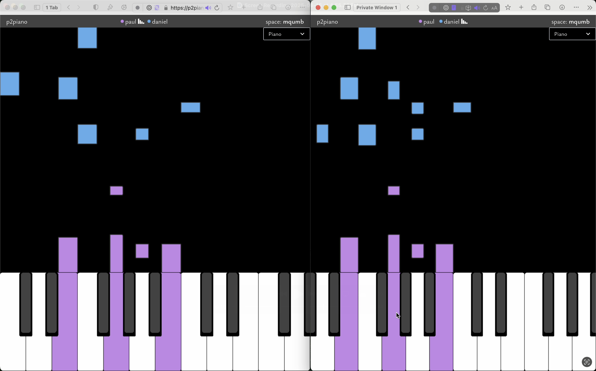

## p2piano
[p2piano](https://p2piano.com) is peer-to-peer platform for playing piano with others in real time, which features an audio synchronization engine. There's no signup, no ads, and no tracking.

You can follow the development blog at [d-buckner.org](https://d-buckner.org)

### Self-Hosting
To self-host p2piano, you'll need to
1. Ensure you have docker and docker compose
2. Clone the repo
3. Run `docker compose up` in the root of the repo
4. Open http://localhost:8345 in your browser
